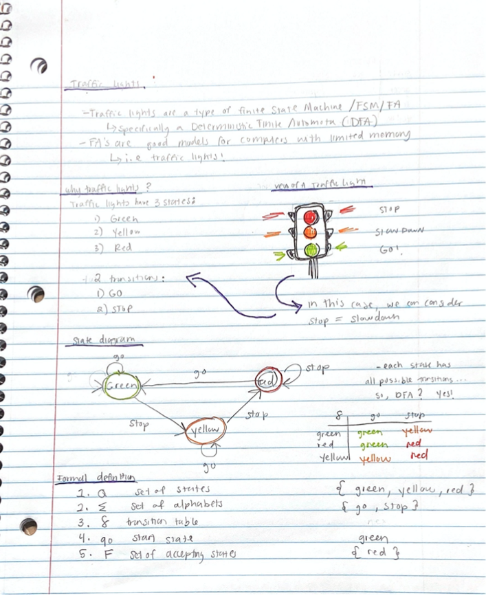

# finitestatemachine
<bold> Finite State Machines,</bold> or Finite automata, are good models for computers with an extremely limited amount of memory. This project was based on a type of finite automata, called a deterministic finite automot (DFA). DFA's are the most simple type of finite automota, where each state is entirelay based on the input character. This project was based on a Traffic Light, which can be agues as a DFA.
 
 

